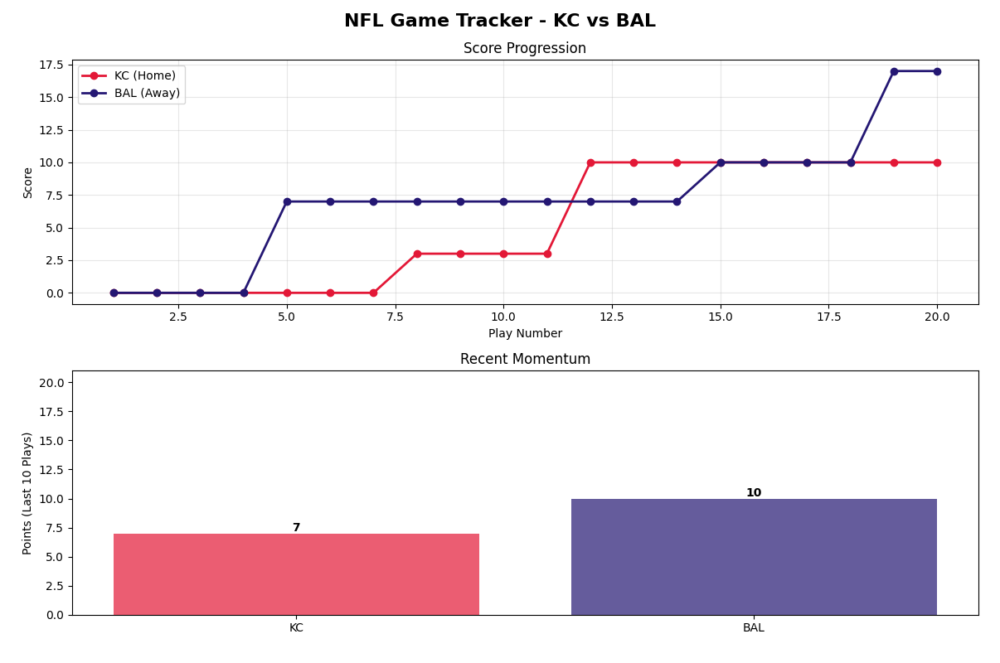

# NFL Streaming Pipeline

A real-time NFL game tracking system that streams play-by-play data through Apache Kafka and visualizes game progression with dynamic charts.

## Project Overview

This project demonstrates streaming data analytics by simulating NFL game events flowing through a Kafka pipeline. The system tracks scoring events, calculates team momentum, and provides live visualization of game statistics.

### Key Features
- **Real-time streaming**: Play-by-play data flows through Kafka topics
- **Score tracking**: Monitors cumulative scores for both teams throughout the game
- **Momentum analysis**: Calculates recent scoring trends (last 10 plays) to show which team has momentum
- **Live visualization**: Dual-chart display showing score progression and current momentum

## Insight Focus

**What insight are we gaining?** The pipeline answers: "How does game momentum shift during an NFL game, and which team is 'hot' right now?"

By tracking the last 10 plays, we can see when a team goes on a scoring run versus when the game is evenly matched. This is more insightful than just showing the score - it reveals **momentum shifts** that indicate which team is dominating recent play.

## Project Structure

```
nfl-streaming-pipeline/
├── producers/
│   └── nfl_producer.py          # Streams play-by-play data to Kafka
├── consumers/
│   └── nfl_consumer.py          # Processes events and visualizes
├── utils/
│   ├── utils_logger.py          # Logging configuration
│   └── utils_kafka.py           # Kafka producer/consumer helpers
├── data/
│   └── sample_game.csv          # Sample NFL play data
├── scripts/
│   └── prepare_kafka.sh         # Kafka setup script
└── requirements.txt
```

## Technology Stack
- **Apache Kafka**: Message streaming platform
- **Python 3.11+**: Core programming language
- **Matplotlib**: Dynamic visualization
- **Pandas**: Data handling

## Setup Instructions

### Prerequisites
- Python 3.11 or higher
- Apache Kafka installed (see P2 setup)
- Windows with WSL (or Mac/Linux)

### 1. Clone and Setup Environment
```bash
git clone https://github.com/bware7/nfl-streaming-pipeline.git
cd nfl-streaming-pipeline
python -m venv .venv
.venv\Scripts\activate  # Windows PowerShell
pip install -r requirements.txt
```

### 2. Start Kafka (Windows WSL)
```bash
wsl
./scripts/prepare_kafka.sh
cd ~/kafka
bin/kafka-server-start.sh config/kraft/server.properties
```
**Keep this terminal open** - Kafka must stay running.

### 3. Run the Consumer (Terminal 1)
Open a PowerShell terminal with (.venv) activated:
```powershell
python consumers/nfl_consumer.py
```
A matplotlib window will open with live charts.

### 4. Run the Producer (Terminal 2)
Open another PowerShell terminal with (.venv) activated:
```powershell
python producers/nfl_producer.py
```
Watch the data stream and charts update in real-time!

## How It Works

### Producer (`nfl_producer.py`)
1. Reads play-by-play data from CSV file
2. Converts each row to JSON format
3. Streams messages to Kafka topic `nfl_events` with 1.5s delay
4. Simulates real-time game progression

### Consumer (`nfl_consumer.py`)
For each incoming message:
1. **Extracts** play details (team, play type, scores)
2. **Stores** in running lists for visualization
3. **Calculates momentum** by summing points from last 10 plays for each team
4. **Updates visualization** with:
   - Line chart showing score progression over time
   - Bar chart showing current momentum (recent points)

### Message Format
```json
{
  "timestamp": "2025-10-02 13:05:23",
  "game_id": "KC_BAL_001",
  "quarter": 1,
  "time_remaining": "12:05",
  "team": "BAL",
  "play_type": "touchdown",
  "points_scored": 7,
  "player_name": "Lamar Jackson",
  "home_score": 0,
  "away_score": 7
}
```

## Visualization



The visualization includes:
- **Top Panel**: Score progression line chart
  - X-axis: Play number
  - Y-axis: Cumulative score
  - Two lines: KC (red) vs BAL (purple)
  
- **Bottom Panel**: Recent momentum bar chart
  - Shows points scored in last 10 plays
  - Reveals which team has "hot hand"
  - Updates dynamically as game progresses

## Key Analytics Insights

1. **Score Tracking**: Maintains running totals for both teams
2. **Momentum Detection**: Rolling window of last 10 plays shows scoring trends
3. **Visual Pattern Recognition**: Charts reveal when teams go on scoring runs
4. **Real-time Updates**: Live streaming enables immediate insight into game flow

## Future Enhancements

- [ ] Add alert system for significant scoring events
- [ ] Include more game statistics (turnovers, yards, etc.)
- [ ] Support multiple simultaneous games
- [ ] Add predictive analytics for game outcome
- [ ] Connect to live NFL API for real game data

## Author
### Bin Ware 